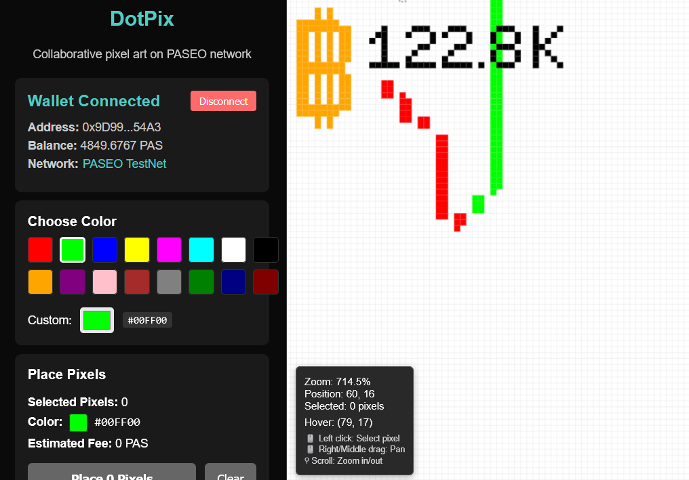

# DotPix - PASEO Pixel Canvas dApp

A decentralized collaborative pixel art application built on the PASEO network (Polkadot ecosystem), recreating the experience of Reddit's r/place with blockchain-based ownership and fee mechanisms.



## Features

### 🎨 Core Functionality

- **2000×2000 Pixel Canvas**: 4 million pixels available for collaborative artwork
- **MetaMask Integration**: Seamless wallet connection for PASEO network
- **Real-time Collaboration**: Live updates as pixels are placed by users worldwide
- **Batch Pixel Placement**: Place up to 100 pixels in a single transaction
- **Dynamic Fee Structure**: Scaled pricing with deflationary tokenomics

### 🔐 Blockchain Features (subject to change)

- **Pixel Ownership**: Each pixel is an on-chain asset with recorded ownership
- **Fee Distribution**: 49% burned (deflationary), 51% to designated recipient
- **Conflict Detection**: Real-time detection of recently modified pixels
- **Reentrancy Protection**: Secure smart contract with protection against attacks

### 🎭 User Experience

- **Intuitive Interface**: Click to select pixels, choose colors, and place artwork
- **Zoom & Pan**: Navigate the large canvas with mouse controls
- **Color Picker**: Predefined palette plus custom color selection
- **Conflict Resolution**: Visual warnings for contested pixels with resolution options

## Quick Start

### Prerequisites

- Node.js 18+
- MetaMask browser extension
- PAS tokens (get from [PASEO faucet](https://faucet.polkadot.io/?parachain=1111))

### Installation

1. **Clone and Install Dependencies**

   ```bash
   git clone <repository-url>
   cd DotPix
   npm install
   cd frontend && npm install
   ```

2. **Set Up Environment**

   ```bash
   # Set your private key for deployment (optional)
   npx hardhat vars set PRIVATE_KEY

   # Create frontend environment file
   echo "VITE_CONTRACT_ADDRESS=your_deployed_contract_address" > frontend/.env
   ```

3. **Run Development Environment**

   ```bash
   # Start frontend
   cd frontend && npm run dev

   # The app will be available at http://localhost:3000
   ```

### MetaMask Setup

Add PASEO network to MetaMask:

- **Network Name**: Polkadot Hub TestNet
- **RPC URL**: https://testnet-passet-hub-eth-rpc.polkadot.io
- **Chain ID**: 420420422 (0x1911f0a6)
- **Currency Symbol**: PAS
- **Block Explorer**: https://blockscout-passet-hub.parity-testnet.parity.io

## Smart Contract Development

### Compilation

```bash
npx hardhat compile
```

### Testing

```bash
NODE_ENV=test npx hardhat test
```

### Deployment to PASEO

```bash
# Set your private key
npx hardhat vars set PRIVATE_KEY your_private_key_without_0x

# Deploy contract
npx hardhat ignition deploy ./ignition/modules/PixelCanvas.js --network passetHub

# Verify deployment
npx hardhat console --network passetHub
```

### Contract Features

#### Fee Structure

- **Base Fee**: 0.001 PAS per pixel
- **Batch Scaling**: +10% per additional pixel in batch
- **Distribution**: 49% burned, 51% to recipient address

#### Security Features

- Reentrancy protection on all state-changing functions
- Overflow protection with Solidity 0.8.28
- Owner-only emergency functions
- Input validation on all parameters

## Usage Guide

### Placing Pixels

1. **Connect Wallet**: Click "Connect MetaMask" and approve network switch
2. **Select Pixels**: Click on canvas pixels to select (multiple selection supported)
3. **Choose Color**: Use color picker or enter custom hex values
4. **Review Conflicts**: Check for recently modified pixels in your selection
5. **Place Pixels**: Confirm transaction in MetaMask

### Canvas Navigation

- **Left Click**: Select/deselect pixels
- **Right/Middle Click + Drag**: Pan around canvas
- **Mouse Wheel**: Zoom in/out
- **Canvas Info**: View coordinates and selection details in sidebar

### Understanding Fees

- Single pixel: 0.001 PAS
- 2 pixels: 0.0022 PAS (10% increase)
- 5 pixels: 0.007 PAS (40% increase)
- Maximum batch: 100 pixels per transaction

## Technical Architecture

### Smart Contract (PixelCanvas.sol)

```solidity
// Core structures
struct Pixel {
    address owner;
    uint32 color;
    uint256 lastModified;
}

// Main functions
function placePixel(uint256 pixelId, uint32 color) external payable
function placePixelsBatch(uint256[] pixelIds, uint32[] colors) external payable
function getPixelsByRange(uint256 start, uint256 count) external view
```

### Frontend Architecture

- **React + TypeScript**: Modern, type-safe frontend
- **Vite**: Fast development and build tooling
- **Ethers.js**: Ethereum/PASEO blockchain interaction
- **Custom Hooks**: Modular state management and blockchain integration

### Key Components

- `Canvas`: High-performance pixel rendering with zoom/pan
- `WalletPanel`: MetaMask connection and network management
- `ConflictDetection`: Real-time pixel conflict analysis
- `RealtimeUpdates`: Live event listening for canvas updates

## Contract Interaction Examples

### Read Operations

```javascript
// Get single pixel
const [owner, color, lastModified] = await contract.getPixel(pixelId);

// Get pixel range
const { owners, colors, timestamps } = await contract.getPixelsByRange(0, 100);

// Calculate fee
const fee = await contract.calculatePixelFee(5); // 5 pixels
```

### Write Operations

```javascript
// Place single pixel
const tx = await contract.placePixel(pixelId, colorInt, { value: fee });

// Place multiple pixels
const tx = await contract.placePixelsBatch(pixelIds, colors, { value: fee });
```

## API Reference

### Smart Contract Events

```solidity
event PixelPlaced(uint256 indexed pixelId, address indexed owner, uint32 color, uint256 fee, uint256 timestamp);
event BatchPixelsPlaced(address indexed owner, uint256[] pixelIds, uint32[] colors, uint256 totalFee, uint256 timestamp);
event FeesDistributed(uint256 burned, uint256 toRecipient);
```

### Frontend Hooks

- `useWallet()`: Wallet connection and network management
- `useContract()`: Smart contract interaction methods
- `useConflictDetection()`: Real-time conflict detection
- `useRealtimeUpdates()`: Live canvas event handling

## Development Workflow

### Adding New Features

1. Smart contract changes in `contracts/PixelCanvas.sol`
2. Update tests in `test/PixelCanvas.test.js`
3. Frontend components in `frontend/src/components/`
4. Integration with hooks in `frontend/src/hooks/`

### Testing Strategy

- **Unit Tests**: Individual contract functions
- **Integration Tests**: End-to-end user workflows
- **Frontend Testing**: Component and hook testing
- **Performance Tests**: Canvas rendering optimization

## Deployment Guide

### PASEO TestNet Deployment

1. **Prerequisites**

   ```bash
   npm install --save-dev @parity/hardhat-polkadot solc@0.8.28
   npm install --force @nomicfoundation/hardhat-toolbox
   npx hardhat vars set PRIVATE_KEY your_private_key
   ```

2. **Deploy Contract**

   ```bash
   npx hardhat compile
   npx hardhat ignition deploy ./ignition/modules/PixelCanvas.js --network passetHub
   ```

3. **Update Frontend**
   ```bash
   echo "VITE_CONTRACT_ADDRESS=deployed_address" > frontend/.env
   cd frontend && npm run build
   ```

### Production Considerations

- Contract size optimization (current: ~95KB, limit: 100KB)
- Gas optimization for batch operations
- Frontend caching strategies for large canvas
- CDN deployment for static assets

## Troubleshooting

### Common Issues

**"CodeRejected" Error**

- Ensure `polkavm: true` in hardhat config
- Verify resolc configuration is present
- Check private key format (64 characters, no 0x prefix)

**Contract Size Too Large**

- Remove unnecessary OpenZeppelin dependencies
- Use minimal custom implementations
- Split functionality across multiple contracts

**Canvas Performance**

- Enable hardware acceleration in browser
- Use chunk loading for large canvas areas
- Optimize zoom levels for better rendering

**Transaction Failures**

- Ensure sufficient PAS balance
- Check network connectivity to PASEO RPC
- Verify MetaMask is on correct network

### Getting Help

- [PASEO Documentation](https://docs.polkadot.io/)
- [Hardhat Polkadot Plugin](https://github.com/parity-polkadot/hardhat-polkadot)
- [Block Explorer](https://blockscout-passet-hub.parity-testnet.parity.io)

## Contributing

1. Fork the repository
2. Create feature branch (`git checkout -b feature/amazing-feature`)
3. Commit changes (`git commit -m 'Add amazing feature'`)
4. Push to branch (`git push origin feature/amazing-feature`)
5. Open Pull Request

### Development Standards

- Follow existing code style and patterns
- Add tests for new functionality
- Update documentation for API changes
- Optimize for gas efficiency in smart contracts

## License

This project is licensed under the MIT License - see the [LICENSE](LICENSE) file for details.

## Acknowledgments

- **Polkadot Team**: For the PASEO testnet infrastructure
- **Reddit r/place**: Inspiration for collaborative pixel art
- **Ethereum Community**: Smart contract patterns and security practices
- **React Community**: Frontend development tools and patterns

---

**Built with ❤️ for the Polkadot ecosystem**
